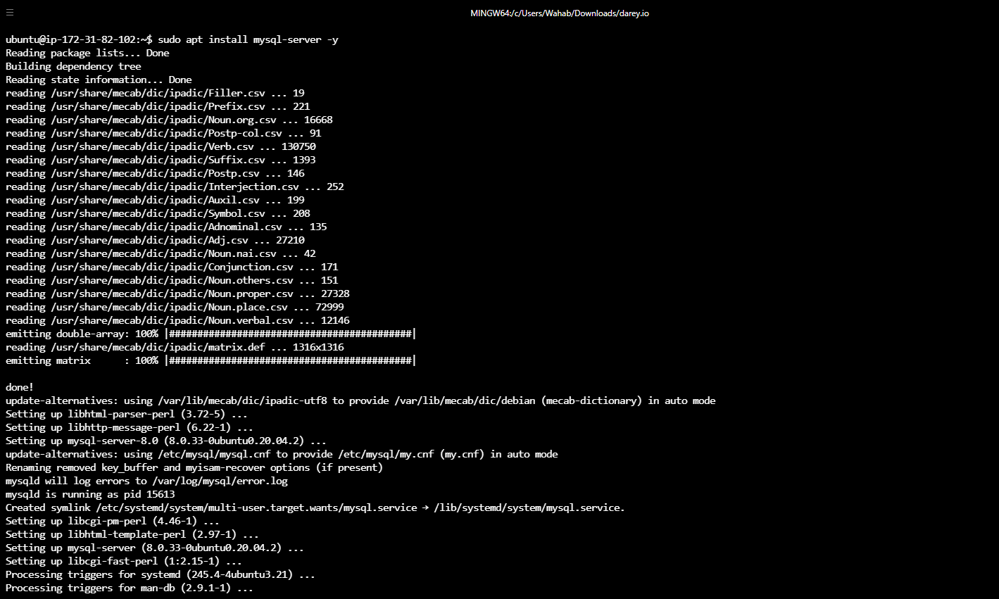

# PROJECT DOCUMENTATION

## Step 1: Install Mysql Server in DB_Server

#### Command: sudo apt update -y (update ubuntu packages)
#### Output:

#### Command: sudo apt install mysl-server -y 
#### Output:

## Step 1: Install Mysql Client in Client_Server

#### Command: sudo apt update -y (update ubuntu packages)
#### Output:

#### Command: sudo apt install mysl-client -y 
#### Output:

### Create user, database and grant permission on mysql_server

#### Setting the inbound rules in mysql server security group.

#### Configure MySQL server to allow connections from remote hosts.

## From Mysql Client: connect remotely to mysql server database engine without using ssh

